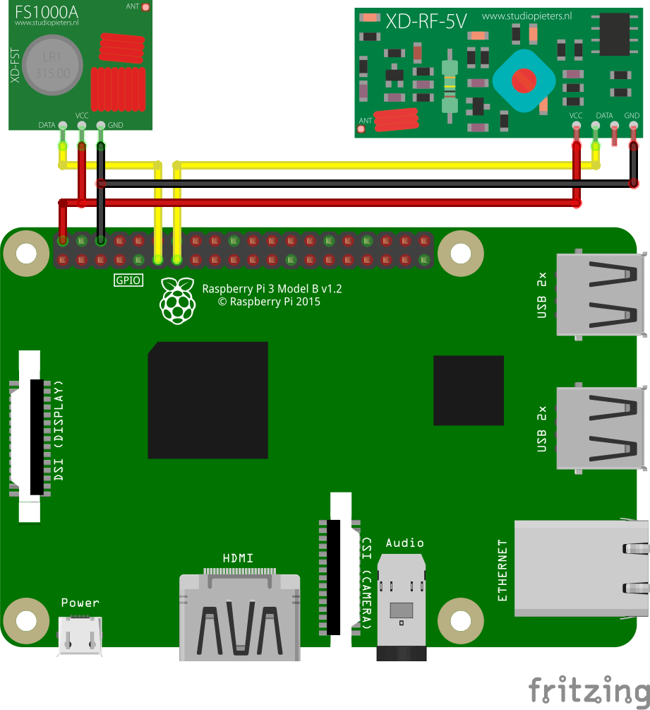

## Hardware
* Raspberry Pi Model 3
* Aukru 433 MHz Funk- Sende und Empfänger Modul
* Breadboard
* Jumperkabel

**ACHTUNG:** Geht nicht mit Ubuntu MATE, sondern nur mit Raspbian!

In Anlehnung an [Raspberry Pi Funksteckdosen (433MHz) steuern – Tutorial](https://tutorials-raspberrypi.de/raspberry-pi-funksteckdosen-433-mhz-steuern/)

1. Schaltplan
    <image-with-lightbox>
        
    </image-with-lightbox>
2. wiringPi installieren und kompilieren:
    ```bash
    sudo apt-get install git git-core
    git clone git://git.drogon.net/wiringPi
    cd wiringPi
    ./build
    ```

3. ```npm install --save rpi-433```

4. NodeJs-Script:
    ```javascript
    const rpi433 = require('rpi-433');

    rfSniffer = rpi433.sniffer({
        pin: 2,
        debounceDelay: 500
    });
    rfSniffer.on('data', (data) => {
        console.log('received', data.code, data.pulseLength);
    });

    rfEmitter = rpi433.emitter({
        pin: 0,
        pulseLength: 350
    });
    rfEmitter.sendCode(code)
            .then((stdout) => {
                console.log('Success', stdout);
            }, (error) => {
                console.log('Error', error);
            });
    ```

    s. auch hier: https://github.com/pschild/433-switcher

5. Wenn das Skript über ```node main.js``` gestartet ist, die Fernbedienung in die Nähe des Empfängers halten und die verschiedenen Knöpfe drücken.