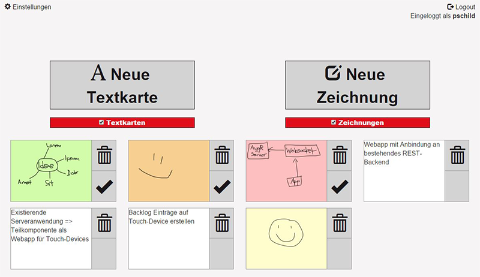
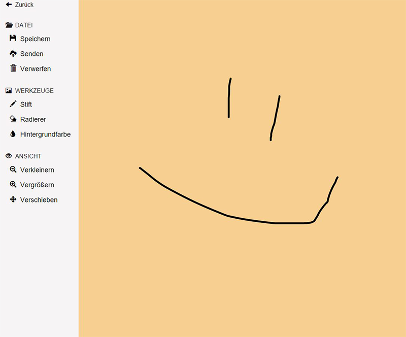
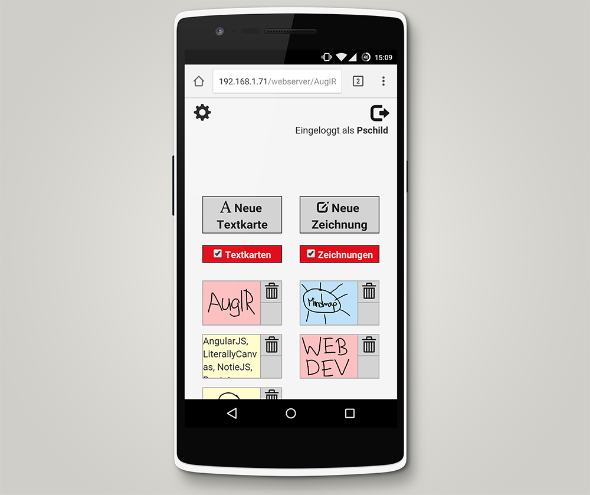
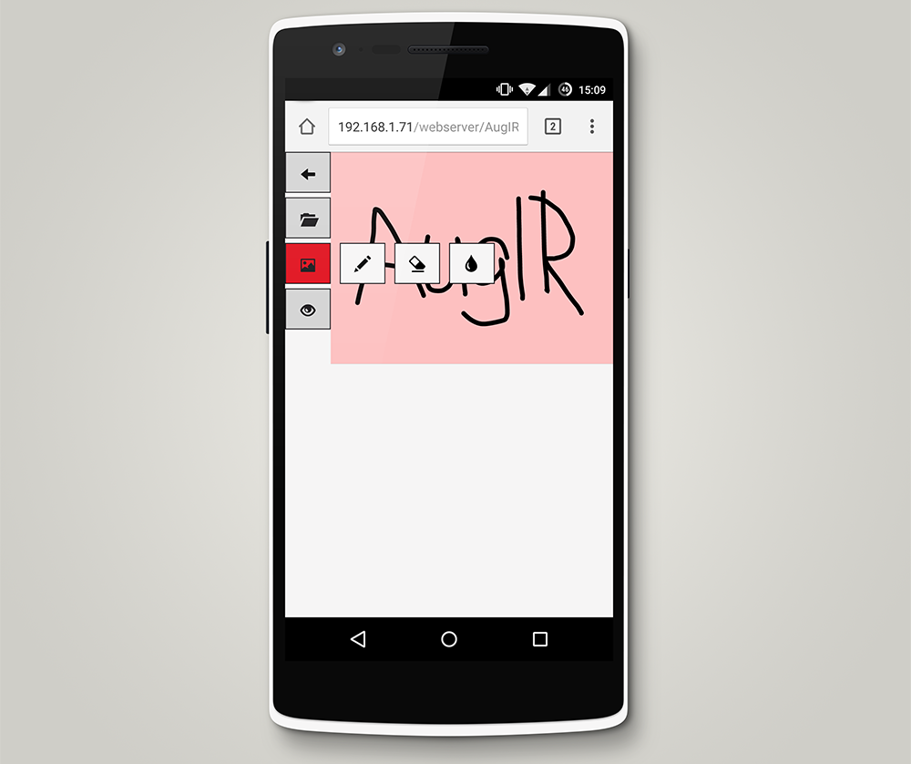
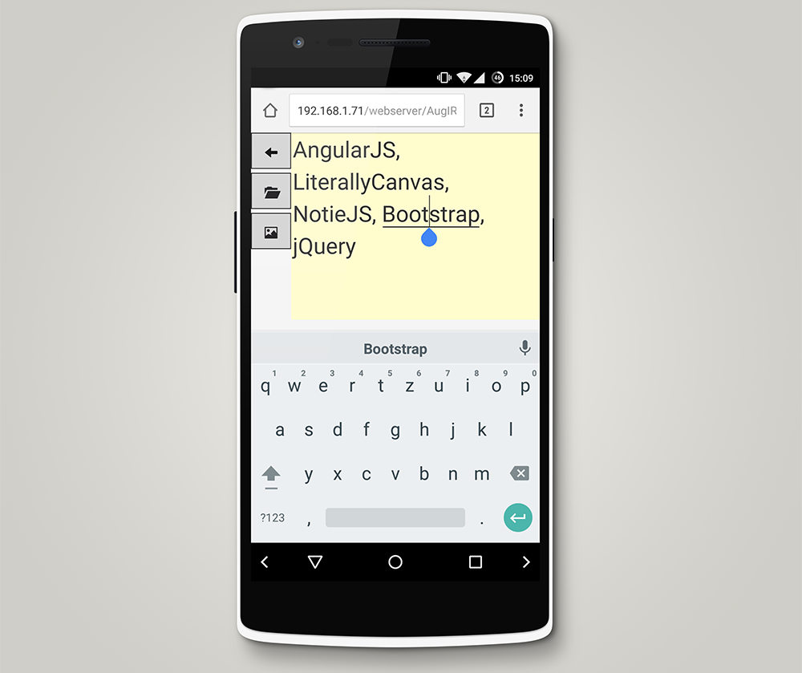
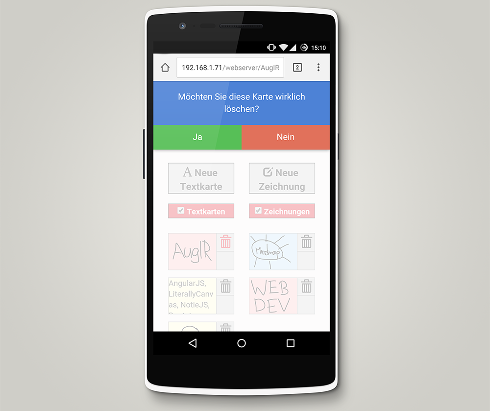

* Abschluss-Projekt der Lehrveranstaltung "Webentwicklung" an der Hochschule Rhein-Waal
* Zusammenarbeit mit Interaction Room GmbH
* Web-App für Notebook und mobile Geräte
* Kompatibilität für: (Edge || IE) && Chrome
* Karteikarten auf Touch-Device erstellen
* Karten sollen an eine bestehende Serveranwendung gesendet werden
* Umsetzung mit AngularJS
* Zeichnen von Storycards per Toucheingabe
* Senden der Storycards an ein Smartboard per WebSocket
* Entwicklung für den <a href="https://www.interaction-room.de/" target="_blank">Interaction Room</a>

<media-slider>
    
    
    
    
    
    
</media-slider>