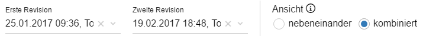

* Bachelorarbeit an der Hochschule Rhein-Waal
* Erstellung einer 3D-Visualisierung mit JavaScript, insb. Three.js
* visualize the structure and quality of software

<media-slider>
    
    
    
    
    
    
</media-slider>