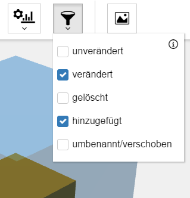

Im Rahmen meiner Bachelorarbeit an der Hochschule Rhein-Waal habe ich eine prototypische Anwendung entwickelt, die die **Struktur und Qualität von Software** visualisieren kann. Das Projekt wurde mit Hilfe der Web-Technologien HTML, CSS und JavaScript umgesetzt. Für die dreidimensionale Visualisierung wurde die Bibliothek <a href="https://threejs.org/" target="_blank">Three.js</a> verwendet.

Der Vergleich verschiedener Versionen von Softwareprojekten soll Tendenzen der **Software-Evolution** aufzeigen und sichtbar machen.

Ziel dieser Anwendung ist es daher, dass Entwickler und auch Projektmanager **Fehler und Möglichkeiten zur Verbesserung ihrer Projekte intuitiv erkunden und lokalisieren** können. Dafür werden **Ergebnisse von statischen Codeanalysen** in Form einer "Stadt" visualisiert: "Gebäude" der Stadt repräsentieren dabei die Dateien, "Bezirke" die Module des Projekts.

<image-gallery>
    
    
    
    
    
</image-gallery>

Die statischen Codeanalysen, deren Ergebnisse mit dem entwickelten Prototypen visualisiert werden, werden mit dem Tool <a href="https://github.com/reflectoring/coderadar" target="_blank">Coderadar</a> durchgeführt.

Das Projekt steht <a href="https://github.com/pschild/CodeRadarVisualization" target="_blank">auf GitHub</a> zur Verfügung. Dort ist ebenfalls eine interaktive <a href="https://pschild.github.io/CodeRadarVisualization/" target="_blank">Demo</a> zu sehen.

<media-slider>
    
    
    
</media-slider>