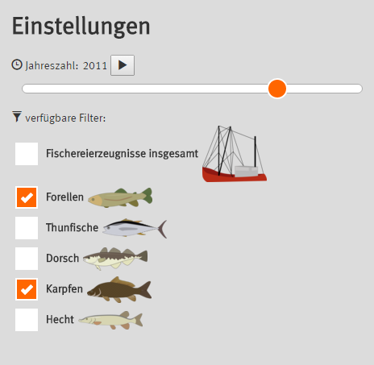
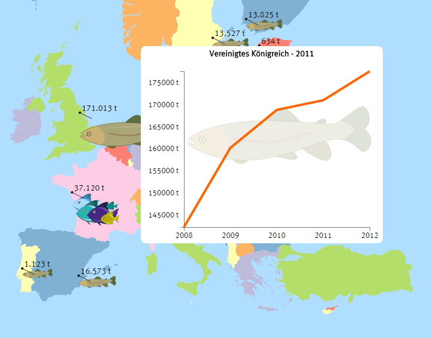
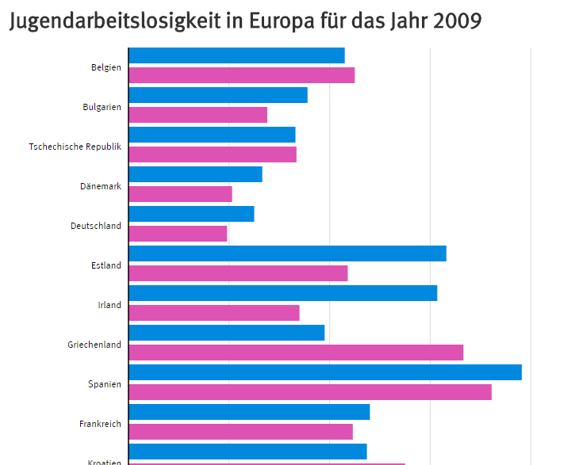
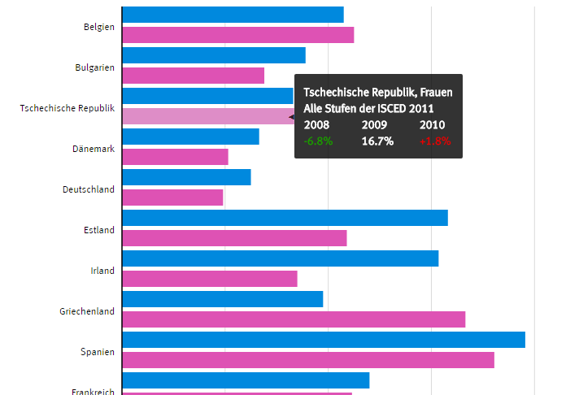

* Abschluss-Projekt der Lehrveranstaltung "Software Engineering" an der Hochschule Rhein-Waal
* Umsetzung mit jQuery und D3.js
* Visualisierung von 2 ausgewählten Statistiken von <a href="http://ec.europa.eu/eurostat/de" target="_blank">Eurostat</a>:
  * Jugendarbeitslosigkeit in Europa (2005 - 2014)
  * Fischfang in Europa (2008 - 2012)
* enge Zusammenarbeit mit dem Statistischen Bundesamt <a href="https://www.destatis.de/DE/Startseite.html" target="_blank">destatis</a>

<media-slider>
    
    
    
    
    
</media-slider>