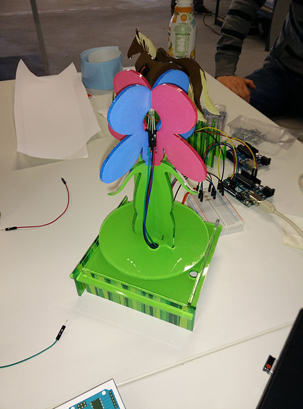

Eine meiner Aufgaben als studentische Hilfskraft an der Hochschule Rhein-Waal war es, im Rahmen des <a href="https://www.girls-day.de/" target="_blank">GirlsDays</a> 2015 einer Gruppe von Schülerinnen die Programmierung mit einem Arduino näher zu bringen.

In Zusammenarbeit mit einer Studentin aus dem Studiengang _Information and Communication Design_ der Hochschule wurden zwei Figuren entwickelt, um die Motivation und den Lerneffekt durch spielerische Elemente zu verstärken. Die zunächst gestalteten Designs wurden auf Plexiglas gedruckt und im Anschluss mit einem Lasercutter ausgeschnitten.

Zum einen wurde ein Pferd designt, das mit Hilfe eines Servo-Motors den Kopf heben und senken kann.

<image-with-lightbox>
    
</image-with-lightbox>

Darüber hinaus wurde eine Blume designt, die sich durch einen Servo-Motor drehen und durch eine RGB-LED in verschiedenen Farben leuchten konnte.

<image-with-lightbox>
    
</image-with-lightbox>

Der zugrunde liegende Arduino-Sketch reagierte dabei auf Tweets an einen vorgegebenen Twitter-Account: je nachdem, ob der Tweet bestimmte Smileys enthielt, verhielt sich die Blume anders:

Beispiele:
* Ein ":-)" im Tweet bewirkte eine schnelle Drehung und grün leuchtendes Licht, um Freude darzustellen.
* Ein ":-(" im Tweet bewirkte eine langsame Drehung und rot blinkendes Licht für die Darstellung von Traurigkeit.

Die Aufgabe der Schülerinnen war es dann u. a., weitere Reaktionen selbst zu programmieren.

<media-slider>
    
    
</media-slider>