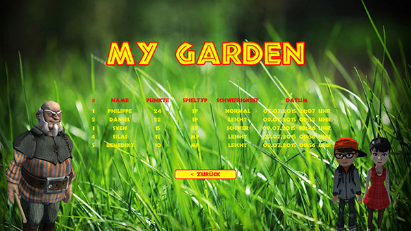
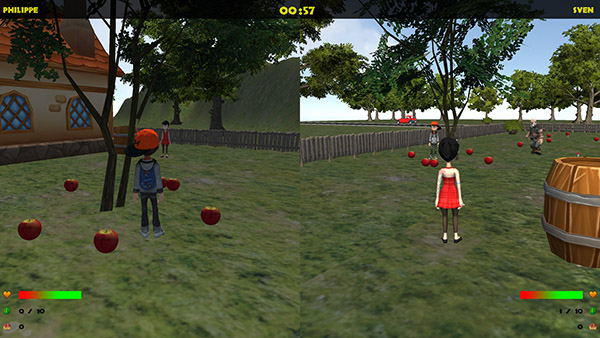
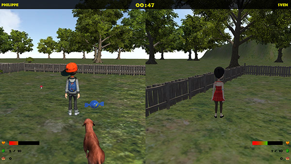

* Abschluss-Projekt der Lehrveranstaltung "Spieleentwicklung" an der Hochschule Rhein-Waal
* Umsetzung mit Unity3d und C#
* Verwendung von Finite State Machines
* u. a. Multiplayer (Splitscreen), Highscore-Tabelle (online)

<media-slider>
    
    
    
    
</media-slider>