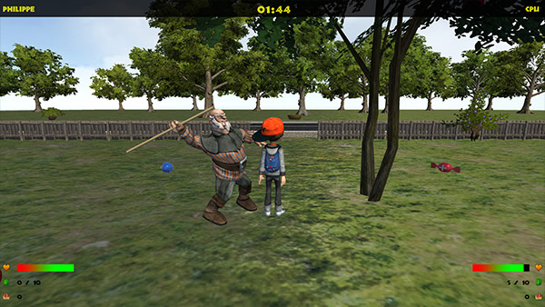

* Abschluss-Projekt der Lehrveranstaltung "Spieleentwicklung" an der Hochschule Rhein-Waal
* Umsetzung mit Unity3d und C#
* Verwendung von Finite State Machines
* u. a. Multiplayer (Splitscreen), Highscore-Tabelle (online)

In dem von uns entwickelten Spiel treten zwei Kinder, ein Mädchen und ein Junge, gegeneinander
an. Sie müssen innerhalb von zwei Minuten so viele Äpfel wie möglich aus einem Obstgarten
holen und zu einem Korb bringen. Der Garten und die Apfelbäume werden jedoch von einem alten
Mann und seinem Hund bewacht, die im Garten patrouillieren und die Kinder davon abhalten wollen
die Äpfel zu stehlen.
Die Spielidee beruht auf dem Brettspiel „Obstgarten“, bei dem die Spieler Obst ernten und in ihren
Körben verstauen müssen, bevor der freche Rabe Theo sie von den Bäumen stibitzt.
Das Spiel kann sowohl im Einzel- als auch im Mehrspielermodus gespielt werden. Im Einzelspielermodus wird die Steuerung eines Spielers vom Computer übernommen.

<media-slider>
    
    
    
    
    <video controls>
        <source src="./myGarden_kompr.mp4" type="video/mp4">
    </video>
</media-slider>

Die NPCs, die im Spiel verwendet werden, haben eine eigene künstliche Intelligenz. Diese wird jeweils
durch eine Finite State Machines (kurz FSM) realisiert. Am Beispiel des Computergegners, gegen den
der Spieler im Einzelspieler antritt, folgt eine Auflistung der verschiedenen Verhaltensweisen:

Der NPC hat vier Verhaltensweisen: Äpfel sammeln, Äpfel zum Korb bringen, Äpfel vom Baum
„ernten“ und fliehen.
* Wenn Äpfel auf dem Rasen liegen, sammelt er diese ein.
* Falls keine Äpfel mehr auf dem Rasen liegen, sucht er den nächstgelegenen Baum, an dem Äpfel
hängen, und „erntet“ diese.
* Steht der NPC in der Nähe eines Baumes und ist mindestens ein Gegner (Opa oder Hund) weniger
als 6m von ihm entfernt (Messung der Entfernung durch <a href="https://docs.unity3d.com/ScriptReference/Physics.Raycast.html" target="_blank">Raycasts</a>), flieht er zu zufällig ausgewählten Orten im Garten. Ist der Gegner
weit genug entfernt, nimmt der NPC seine durch das Fliehen unterbrochene Aufgabe wieder auf.
* Ist der Rucksack des NPCs voll, bringt er diese sofort zum Korb und lädt sie dort ab. Hierbei
spielt es keine Rolle, ob ein Gegner in der Nähe ist - das Wegbringen der Äpfel hat in diesem
Fall höchste Priorität. Anschließend sammelt er erneut herumliegende Äpfel ein.

<image-gallery>
    
    
</image-gallery>