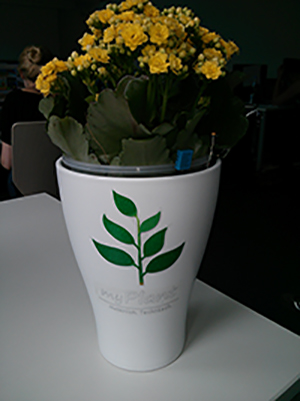
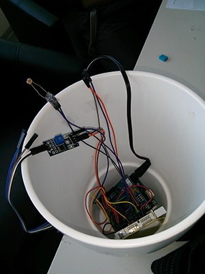
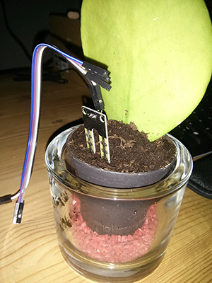
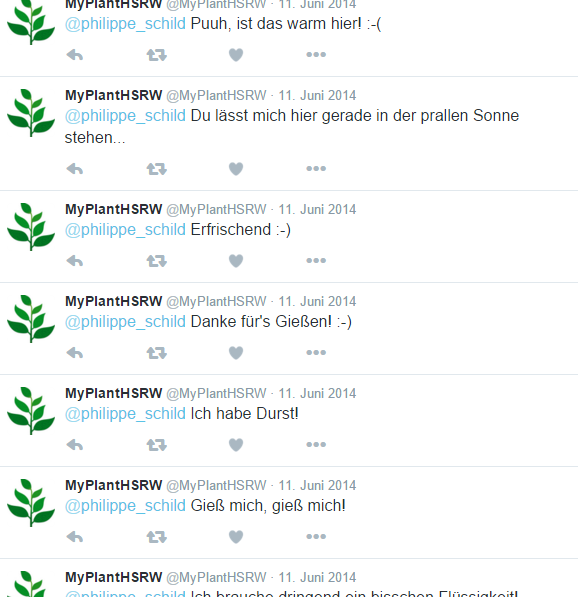
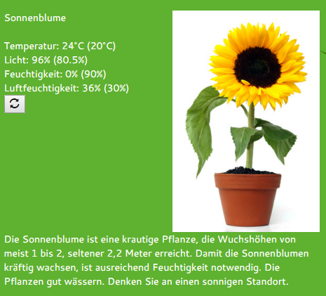
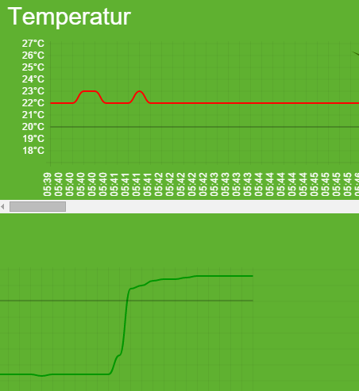

* Abschluss-Projekt der Lehrveranstaltung "Projektmanagement" an der Hochschule Rhein-Waal
* Programmierung von Arduino, Web-App und einer Schnittstelle
* Tracking von Umgebungsdaten der heimischen Pflanzen:
  * Temperatur
  * Luftfeuchtigkeit
  * Feuchtigkeit der Erde (Bodensensor)
  * Helligkeit
* Rückmeldung der Pflanze per Twitter-Anbindung
* Grafischer Verlauf der Werte per Web-App einsehbar

<media-slider>
    
    
    
    
    
    
</media-slider>