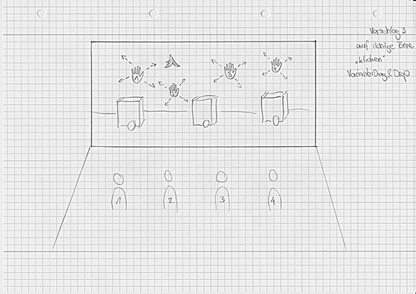
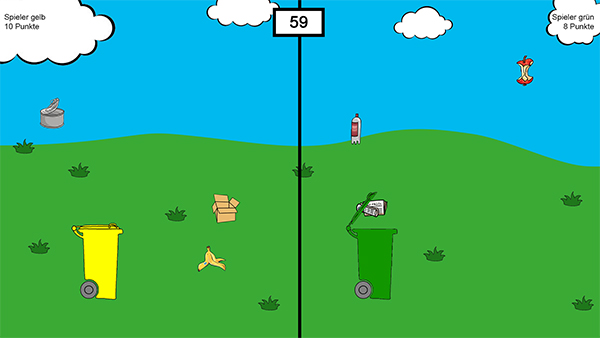
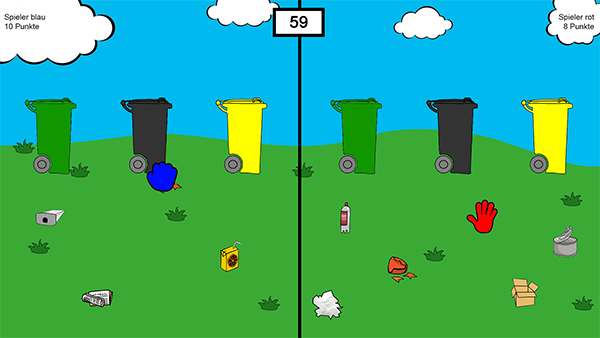

_"Spielerisches Lernen von richtiger Mülltrennung"_ war das Thema des Abschluss-Projektes der Lehrveranstaltung "Fortgeschrittene Interaktionstechnologien" an der Hochschule Rhein-Waal.

Ziel des Projektes ist die Entwicklung eines interaktiven Lernspiels unter Berücksichtung des _Scenario-Based-Design-Prozesses_. Zusammen mit weiteren Kommilitonen wurde ein Konzept auf Basis von Usertests und Befragungen von Grundschulkindern ausgearbeitet. 
Die technische Umsetzung erfolgte mit Hilfe der _Kinect v2_ und _C#_.

<image-with-lightbox>
    
</image-with-lightbox>

Das Spiel soll z. B. durch Lehrpersonen im Rahmen ihrer Unterrichtseinheiten eingesetzt werden können und somit neben dem klassischen Frontalunterricht etwas Abwechslung in den Lernalltag bringen. Die Schüler sollen somit auf spielerische Weise das erlernte Wissen anwenden und vertiefen.

Im Rahmen des Projektes wurden zwei verschiedene Spielmodi entwickelt, die im Anschluss mit Schülern einer Grundschule getestet wurden.

## Prototyp 1: Herabfallenden Müll einsammeln
Jeweils zwei Spieler treten gegeneinander an. Jeder Spieler steuert mit seiner rechten Hand eine Mülltonne nach links und rechts. Bei geöffneter Hand ist auch der Deckel der Mülltonne geöffnet. Schließt der Spieler allerdings seine Hand, schließt sich auch der Deckel seiner Mülltonne. Auf diese Weise kann der Spieler die von oben herabfallenden Müll-Gegenstände im richtigen Moment mit seiner Tonne einsammeln.

Wird der Gegenstand richtig einsortiert, erhält der Spieler einen Punkt. Wird der Gegenstand falsch einsortiert, bekommt der Spieler einen Punkt abgezogen.

Die Zeit ist auf 90 Sekunden begrenzt. Der Spieler, der nach Ablauf der Zeit die meisten Punkte hat, gewinnt das Spiel.

<image-with-lightbox>
    
</image-with-lightbox>

## Prototyp 2: Herumliegenden Müll einsortieren
Jeweils zwei Spieler treten gegeneinander an. Jeder Spieler steuert mit seiner rechten Hand einen Handschuh in seiner Farbe über den Bildschirm. Schließt der Spieler seine Hand, wird auch der entsprechende Handschuh auf dem Bildschirm in Form einer geschlossenen Hand dargestellt. Auf diese Weise kann der Spieler die auf der Wiese liegenden Müll-Gegenstände greifen. Mit geschlossen gehaltener Hand müssen die gegriffenen Müll-Gegenstände nun in die korrekte Mülltonne einsortiert werden. Dies geschieht, indem der Spieler seine Hand erneut öffnet, wenn sich sein Handschuh über der jeweiligen Tonne befindet.

Wird der Gegenstand richtig einsortiert, erhält der Spieler einen Punkt.

Die Zeit ist auf 90 Sekunden begrenzt. Der Spieler, der nach Ablauf der Zeit die meisten Punkte hat, gewinnt das Spiel.

<image-with-lightbox>
    
</image-with-lightbox>