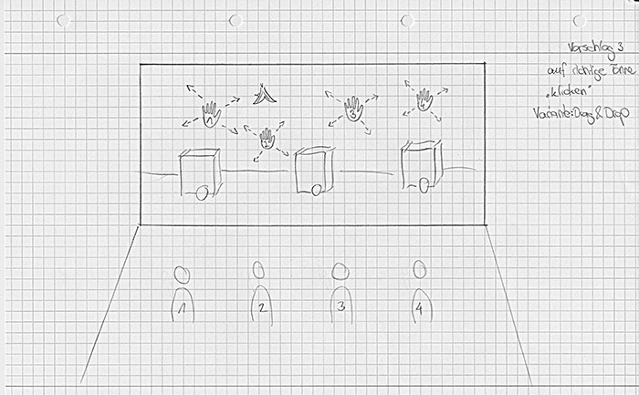

* Abschluss-Projekt der Lehrveranstaltung "Fortgeschrittene Interaktionstechnologien" an der Hochschule Rhein-Waal
* Spielerisches Lernen von richtiger Mülltrennung
* Ausarbeitung eines Konzeptes auf Basis von Usertests und Befragungen von Grundschulkindern
* Umsetzung mit der Kinect v2 und C#

<media-slider>
    
    
    
</media-slider>