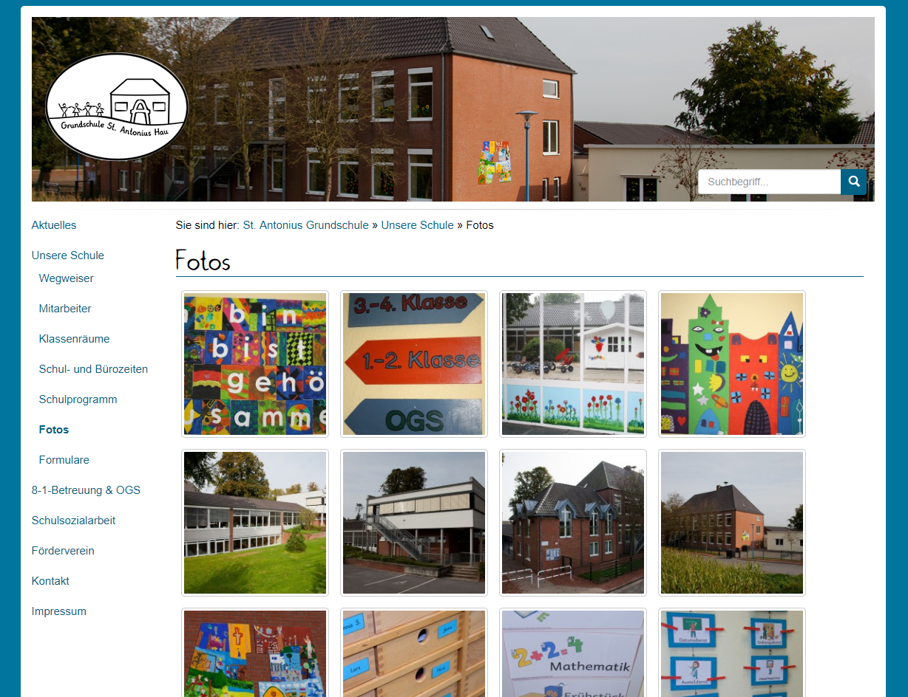
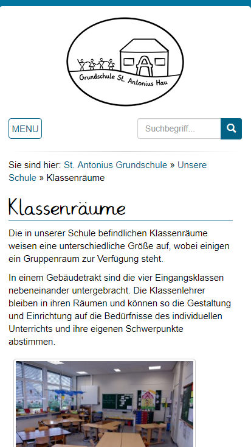
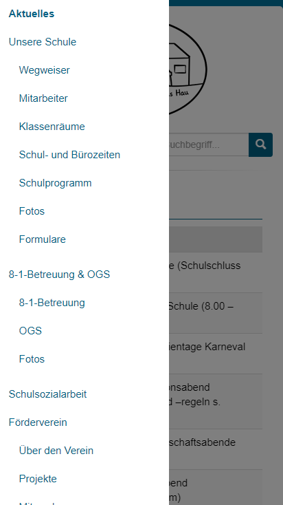

Für die Grundschule St. Antonius wurde ein <a href="https://antonius-hau.de/" target="_blank">Webauftritt</a> geplant und umgesetzt.

Die Webseite basiert auf einer Wordpress-Installation. Somit können die Inhalte der Webseite durch das Personal selbst gepflegt werden.

Die Struktur und das Design wurden mit der Schule abgesprochen und entsprechend der Wünsche umgesetzt. Natürlich wurde die Webseite auch für mobile Endgeräte optimiert (Responsive Webdesign).

<image-gallery>
    
    
    
</image-gallery>