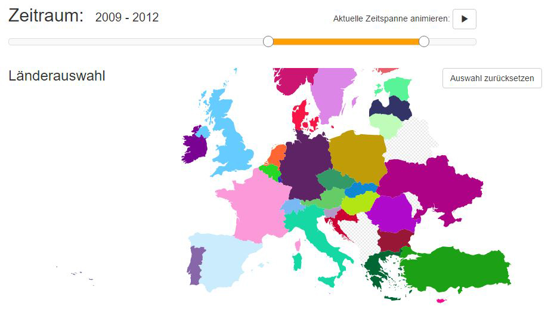

In der Lehrveranstaltung "Interdisziplinäres Projekt" an der Hochschule Rhein-Waal war es unsere Aufgabe, in studiengangsübergreifenden Teams ein Projekt zum Thema Datenvisualisierung umzusetzen.

Zusammen mit Kommilitonen wurde so ein interaktives Dashboard mit AngularJS und D3.js umgesetzt. Thema der mittels des Dashboard dargestellten Daten war "Geburten in Europa". 
Als Quelle für die Daten diente uns hierbei das <a href="http://ec.europa.eu/eurostat/de/home" target="_blank">Statistische Amt der Europäischen Union (Eurostat)</a>. 
Die Grafiken sowie die Farbgebung wurde von einer Studentin des Studiengangs _Information and Communication Design_ erstellt und in geeigneter Form (SVG) zur Verfügung gestellt.

<image-with-lightbox>
    
</image-with-lightbox>

Das Dashboard umfasste neben einer Europakarte ein Linien- sowie zwei Balkendiagramme zur Visualisierung der Datensätze. Der Benutzer konnte Daten im Zeitraum von 2004 bis 2013 für ganz Europa miteinander vergleichen.

<media-slider>
    
    
    
    
    
</media-slider>

Die Besonderheit des Dashboards war es, dass sich die verschiedenen Filter und Einstellungsmöglichkeiten auf alle Teil-Visualisierungen gleichzeitig auswirkten. Durch die Anpassung des Zeitraums über den Slider oder das Aus- bzw. Abwählen eines oder mehrerer Länder über die Europakarte wurden somit die verschiedenen Diagramme beeinflusst und änderten sich entsprechend den neuen Einstellungen.

Technisch wurde dies mit Hilfe von Events in der AngularJS-Anwendung realisiert. Die folgende Grafik zeigt eine Übersicht des Event-Systems und die Zusammenhänge zwischen den einzelnen Teilen des Dashboards:

<image-with-lightbox>
    
</image-with-lightbox>