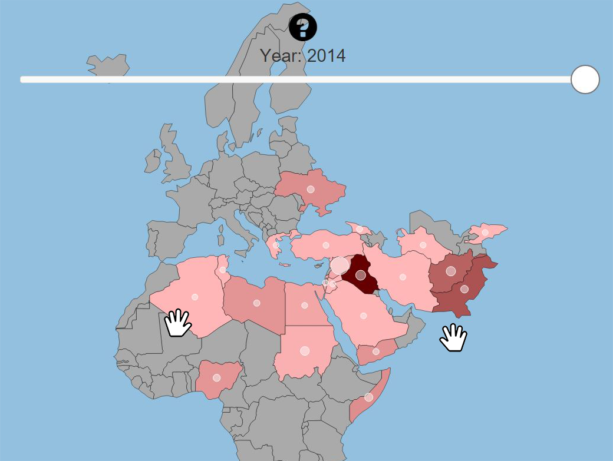
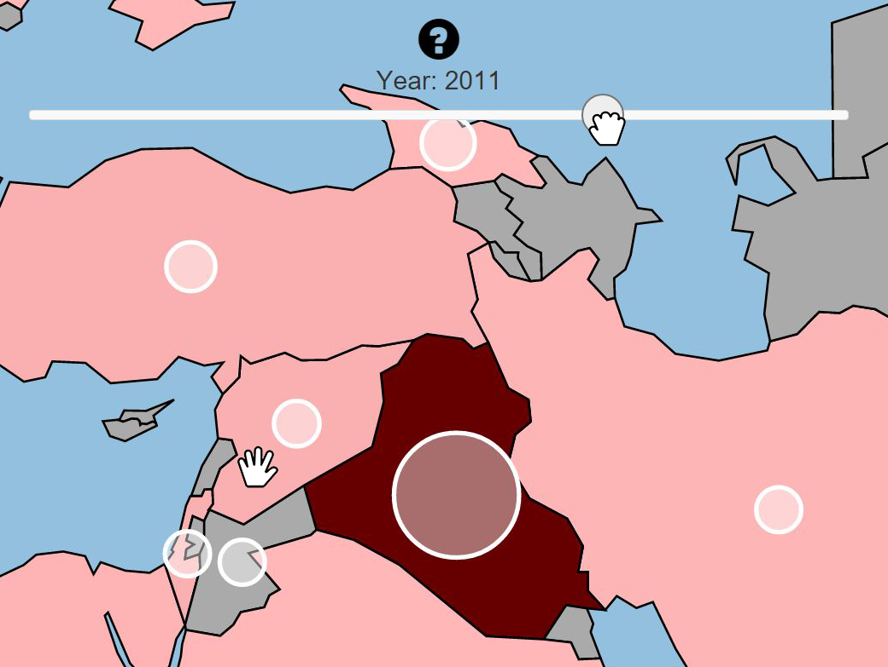
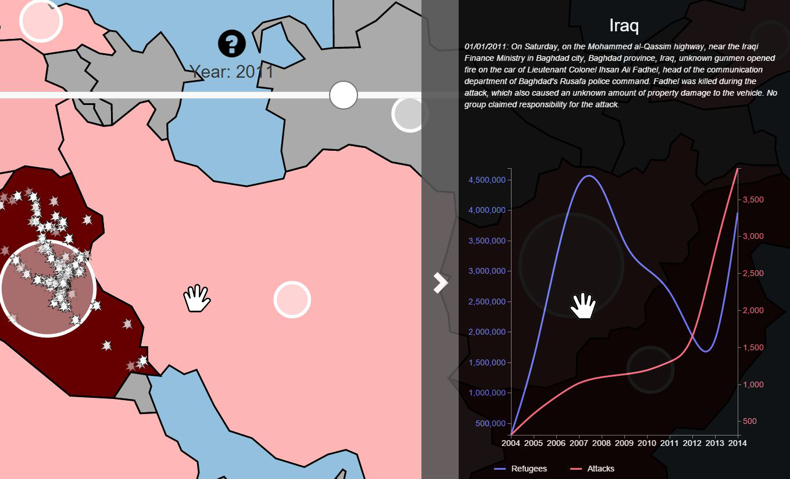
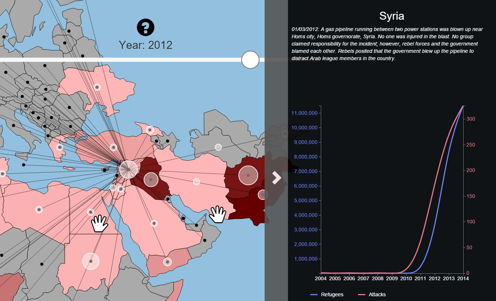

* Abschluss-Projekt der Lehrveranstaltung "Multimediale Technologien" an der Hochschule Rhein-Waal
* Frontend: AngularJS und D3.js
* Backend: C# (WPF-Anwendung)
* Kommunikation zwischen Back- und Frontend via WebSockets
* Übertragung von Handpositionen und Gesten von der Kinect an den Browser
* Interaktive Visualisierung von Flüchtlingsbewegungen und deren Ursachen

<media-slider>
    
    
    
    
</media-slider>