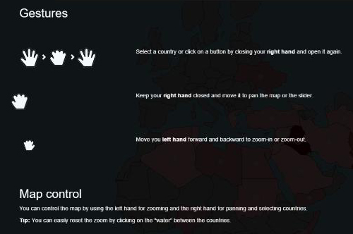

_"Es gibt einen Zusammenhang zwischen verübten Terroranschlägen und Flüchtlingsbewegungen."_ - diese These sollte im Rahmen dieses Projektes, das als Abschluss-Projekt der Lehrveranstaltung "Multimediale Technologien" an der Hochschule Rhein-Waal durchgeführt wurde, überprüft werden.

Zusammen mit mehreren Kommilitonen wurde dazu eine interaktive Datenvisualisierung zum Thema "Flüchtlingsströme und ihr Auslöser" erstellt. Ziel war es, innerhalb der Visualisierung mögliche Zusammenhänge zwischen Terroranschlägen und Flüchtlingsbewegungen zu untersuchen. Der Benutzer sollte so in der Lage sein, die Visualisierung explorativ zu erkunden. Als Datenbasis wurden Datensätze des <a href="http://www.unhcr.org/data.html" target="_blank">United Nations High Commissioner for Refugees (UNHCR)</a> und aus der <a href="http://www.start.umd.edu/gtd/" target="_blank">Global Terrorism Database</a> verwendet.

<image-with-lightbox>
    
</image-with-lightbox>

Die Steuerung der Visualisierung durch den Benutzer wurde mit Hilfe einer _Kinect V2_ realisiert. 
Eine in C# programmierte WPF-Anwendung war dafür zuständig, die Handpositionen und -bewegungen des Benutzers zu erkennen und zu verfolgen. Die Visualisierung selbst wurde in Form einer Webanwendung mit AngularJS und D3.js programmiert, sodass diese im Browser lauffähig war.

<image-gallery>
    
    
    
</image-gallery>

Die Kommunikation zwischen WPF- und Webanwendung wurde mittels WebSockets realisiert, mit denen die von der Kinect erkannten Handpositionen an die Webanwendung übertragen wurden.

Erkannt werden konnte dabei folgendes:
* X- und Y-Position der Hände zur Bewegung der Zeiger im Browser
* Z-Position der Hände zur Realisierung von Zoom-Effekten im Browser
* Status der Hände (geöffnete bzw. geschlossene Hand) zur Realisierung von "Klicks" im Browser

<image-with-lightbox>
    
</image-with-lightbox>