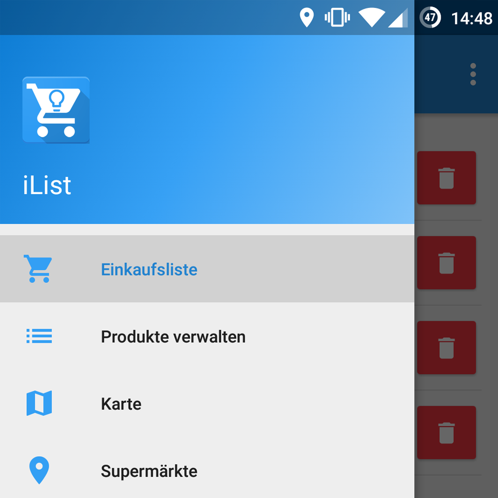
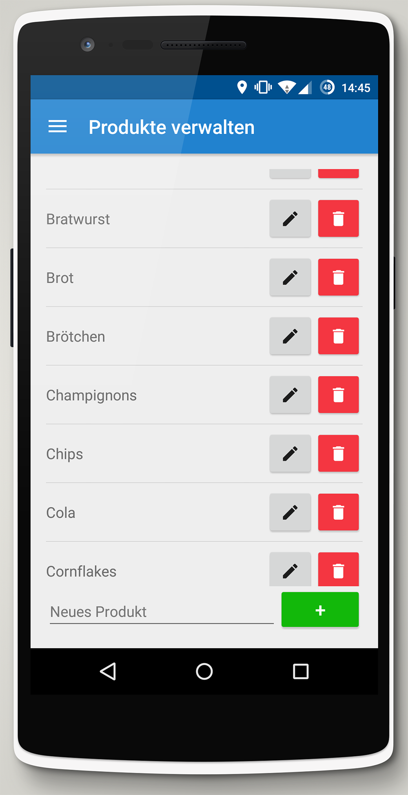
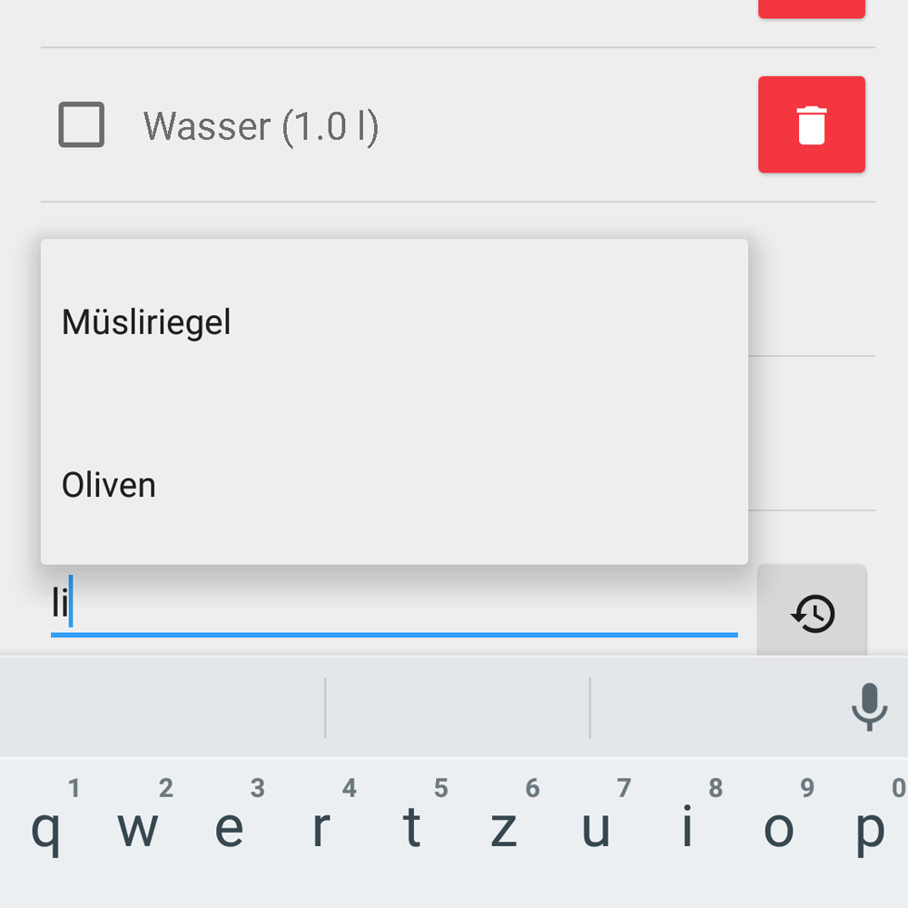
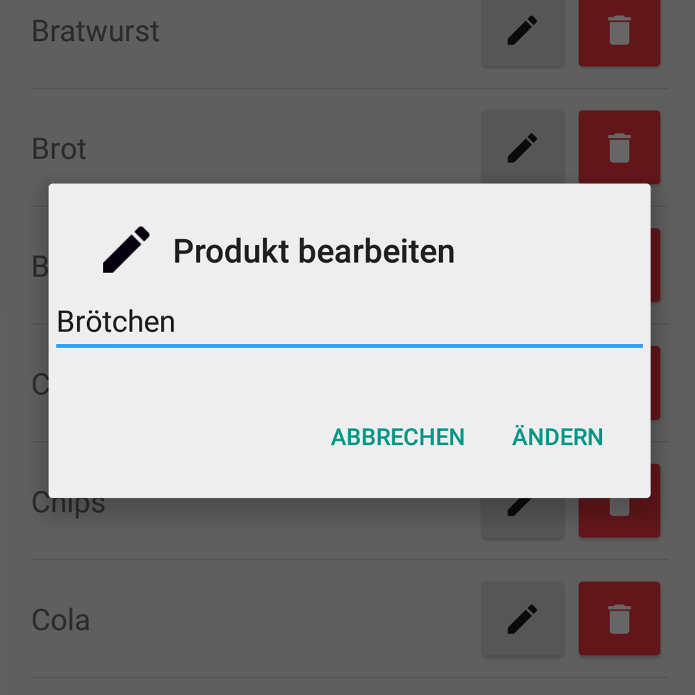
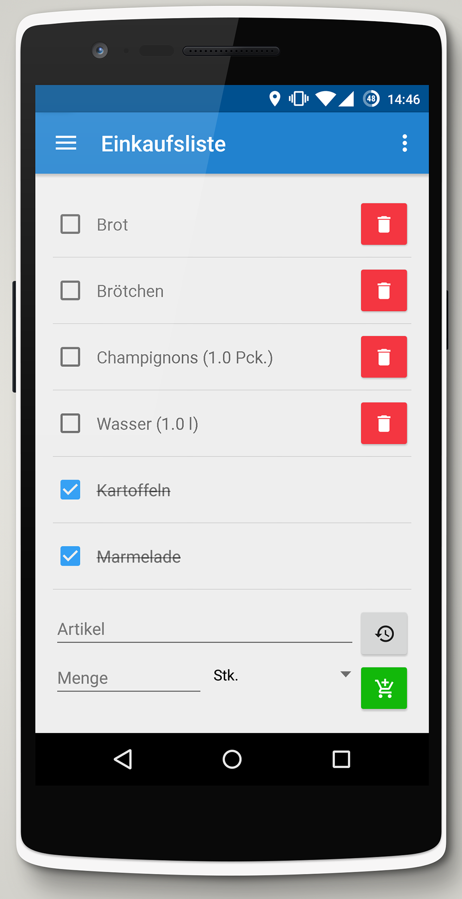
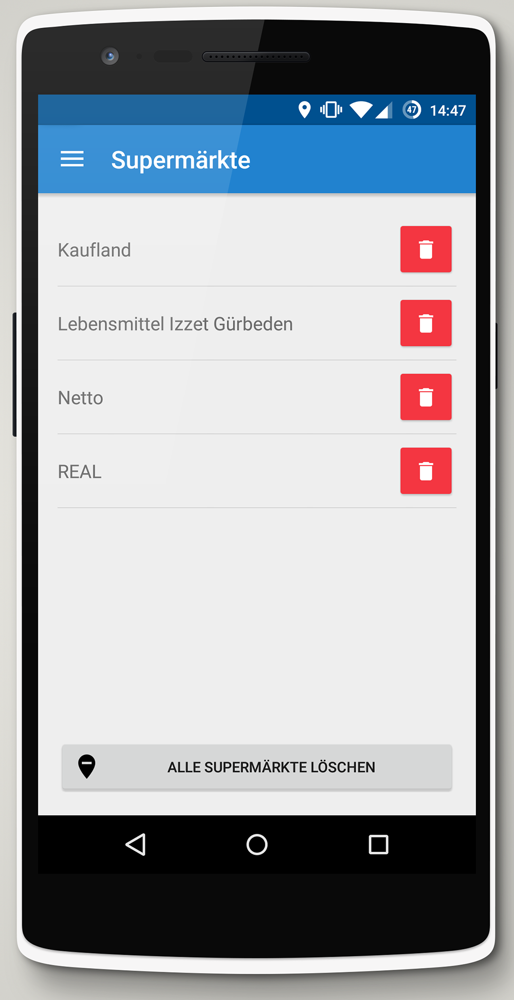
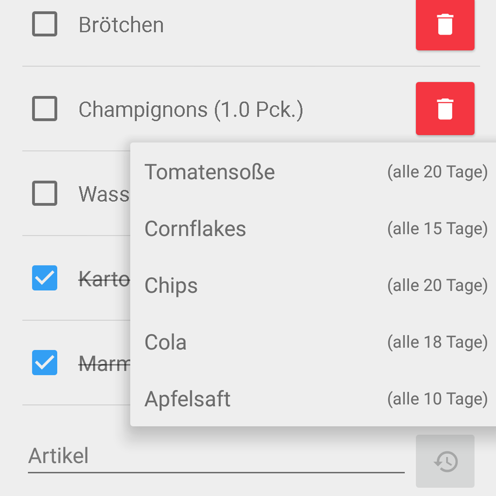

Im Rahmen des Abschluss-Projektes der Lehrveranstaltung "Mobile Development" an der Hochschule Rhein-Waal wurde zusammen mit mehreren Kommilitonen die Smartphone-Anwendung "iList" umgesetzt.

"iList" soll den "klassischen" Einkaufszettel aus Papier ersetzen. Der Nutzer dieser Anwendung hat die Möglichkeit, sich seine eigene Einkaufsliste mit selbst definierten Produkten in einer bestimmten Menge zu erstellen.

<image-gallery>
    
    
    
    
    
</image-gallery>

Mit Hilfe von <a href="https://developer.android.com/training/location/geofencing.html" target="_blank">Geofences</a> erhält der Nutzer Push-Notifications, wenn er sich in der Nähe eines Supermarktes aufhält.

<image-gallery>
    
    
    
</image-gallery>

Darüber hinaus analysiert die Anwendung die Einkaufsgewohnheiten des Benutzers. Sie erinnert ihn, wenn ein Produkt aufgebraucht sein _könnte_ und schlägt dann vor, dieses Produkt zur Einkaufsliste hinzuzufügen. Diese Vorschläge basieren auf den unterschiedlichen Kaufintervallen des jeweiligen Produktes (z. B. wird im Schnitt alle 10 Tage "Apfelsaft" gekauft).

<image-with-lightbox>
    
</image-with-lightbox>