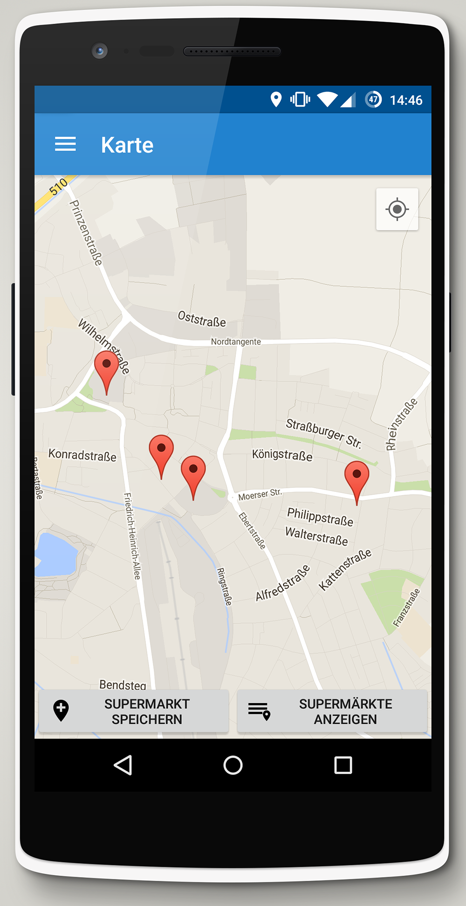

* Abschluss-Projekt der Lehrveranstaltung "Mobile Development" an der Hochschule Rhein-Waal
* Umsetzung einer Android-App zum Verwalten von digitalen Einkaufszetteln
* Mit Hilfe von <a href="https://developer.android.com/training/location/geofencing.html" target="_blank">Geofences</a> erhält der Nutzer Push-Notifications, wenn er sich in der Nähe eines Supermarktes aufhält
* Analyse des individuellen Einkaufsverhaltens: Vorhersage, wann welches Produkt voraussichtlich erneut gekauft werden muss

<media-slider>
    
    
    
    
    
    
    
    
    
</media-slider>